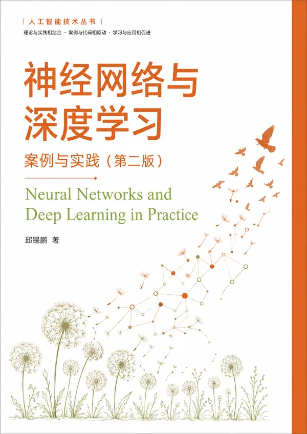

# 神经网络与深度学习：案例与实践

<p align="center"><strong>从张量和自动求导出发，亲手搭建模型与训练框架，再走到 Transformer、大语言模型和智能体。</strong></p>

<p align="center">
  <a href="https://nndl.ai/nndl-practice/">本书页面</a> ·
  <a href="https://github.com/nndl/nndl-practice/releases/download/book-pdf/nndl-practice.pdf">下载 PDF</a> ·
  <a href="#快速开始">快速开始</a> ·
  <a href="#章节目录">章节目录</a> ·
  <a href="https://github.com/nndl/nndl-practice/issues">勘误与建议</a>
</p>

<table>
  <tr>
    <td width="30%" align="center" valign="top">
      
    </td>
    <td width="70%" valign="top">
      <h3>第二版 · PyTorch 配套代码</h3>
      <p>本书把神经网络模型、深度学习原理和工程实践放在同一条学习线上：一边理解模型，一边用 PyTorch 从零实现关键组件，再把它们用于可运行的案例。</p>
      <p>全书共 10 章，仓库提供 17 个 Notebook、逐章实现说明和配套测试。从线性模型、卷积网络和循环网络出发，逐步进入注意力机制、图神经网络、大语言模型与智能体。</p>
      <p><strong>适合读者：</strong>正在学习深度学习的本科生、研究生、工程师，以及希望把《神经网络与深度学习》理论内容真正跑起来的读者。</p>
      <p><strong>当前状态：</strong>第二版处于出版筹备阶段，PDF 与配套代码会随出版前修订持续更新。</p>
    </td>
  </tr>
</table>

## 先从哪里开始

| 你的目标 | 建议路径 |
|---|---|
| 第一次使用 PyTorch | 第 1 章 → 第 2 章 → 第 4 章 |
| 系统学习深度学习实践 | 按第 1—10 章顺序学习 |
| 计算机视觉 | 第 1 章 → 第 4 章 → 第 5 章 → 第 7 章 |
| 序列建模与 Transformer | 第 1 章 → 第 4 章 → 第 6 章 → 第 8 章 |
| 大语言模型与智能体 | 第 8 章 → 第 10 章；基础薄弱时先补第 1、4 章 |
| 图神经网络 | 第 1 章 → 第 4 章 → 第 9 章 |

## 章节目录

| 章 | 主题与代码入口 | 主要实践内容 |
|---|---|---|
| 1 | [实践基础](pytorch/chap1实践基础/) | Tensor、广播、自动微分、`nn.Module`、`Dataset` 与 `DataLoader` |
| 2 | [机器学习概述](pytorch/chap2机器学习概述/) | 机器学习五要素、线性与多项式回归、`RunnerV1`、加州房价预测 |
| 3 | [线性模型](pytorch/chap3线性模型/) | Logistic/Softmax 回归、手写梯度、`RunnerV2`、鸢尾花分类 |
| 4 | [前馈神经网络](pytorch/chap4前馈神经网络/) | 激活函数、手算反向传播、MLP、`RunnerV3`、Moons 与鸢尾花分类 |
| 5 | [卷积神经网络](pytorch/chap5卷积神经网络/) | 从零实现卷积、LeNet-5、残差网络、MNIST 与 CIFAR-10 |
| 6 | [循环神经网络](pytorch/chap6循环神经网络/) | SRN、LSTM、梯度截断、变长序列与双向 LSTM |
| 7 | [网络优化与正则化](pytorch/chap7网络优化与正则化/) | 优化器、参数初始化、BatchNorm、暂退法（Dropout）与学习率调度 |
| 8 | [注意力机制](pytorch/chap8注意力机制/) | 加性注意力、缩放点积注意力、多头注意力、位置编码与 Transformer |
| 9 | [图神经网络](pytorch/chap9图神经网络/) | GCN、GraphSAGE、GAT、GIN，以及节点级与图级任务 |
| 10 | [大语言模型与智能体](pytorch/chap10大语言模型与智能体/) | nanoGPT、解码与 KV Cache、LoRA、SFT、DPO、ReAct 与 RAG |

每章目录中都有 Notebook 入口和实现要点；完整环境说明、数据集下载方式与批量执行方法见 [`pytorch/README.md`](pytorch/README.md)。

## 快速开始

环境要求：64 位 Python 3.11+、PyTorch 2.7+。所有 Notebook 都可在 CPU 上运行，第 5 章和第 10 章使用 GPU 会更快。

```bash
git clone https://github.com/nndl/nndl-practice.git
cd nndl-practice
python -m venv .venv
```

激活虚拟环境：

```bash
# macOS / Linux
source .venv/bin/activate

# Windows PowerShell
.venv\Scripts\Activate.ps1
```

安装 CPU 版本并打开第一个 Notebook：

```bash
python -m pip install --upgrade pip
pip install torch torchvision --index-url https://download.pytorch.org/whl/cpu
pip install -r pytorch/requirements.txt
jupyter notebook "pytorch/chap1实践基础/实践基础.ipynb"
```

使用 NVIDIA GPU 时，请按 [PyTorch 官方安装页](https://pytorch.org/get-started/)选择与本机 CUDA 环境匹配的安装命令。

## 不只是十组 Notebook

配套代码会随着章节推进，逐步搭建轻量级学习框架 [`pytorch/nndl/`](pytorch/nndl/)：

| 组件 | 学习重点 |
|---|---|
| `RunnerV1` | 闭式求解、评价、预测与参数保存 |
| `RunnerV2` | 梯度训练、验证集评价与早停法 |
| `RunnerV3` | `DataLoader`、`state_dict`、指标解耦与训练历史 |
| `nndl` 算子与模型 | 从基础算子、损失函数和优化器，逐步扩展到 CNN、RNN 与注意力机制 |

Notebook 在关键组件第一次出现时展示完整实现，后续章节则通过 `from nndl import ...` 复用工程化版本。这样既能看清原理，也能保持代码可维护。

## 测试与复现

每章都有一组 sanity 测试，用来检查关键算子、模型形状和核心结论：

```bash
python -m pytest pytorch/tests/ -v
```

单章测试可以直接指定文件，例如：

```bash
python -m pytest pytorch/tests/test_chap8.py -v
```

## 版本关系

| 内容 | 位置 | 说明 |
|---|---|---|
| 第二版 PyTorch 实现 | [`pytorch/`](pytorch/) | 本仓库当前维护的主线，共 10 章 |
| 第一版 PaddlePaddle 实现 | [nndl/practice-in-paddle](https://github.com/nndl/practice-in-paddle) | 对应 2022 年出版的第一版，共 8 章 |
| 理论书第一版编程练习 | [`legacy/`](legacy/) | 原 `nndl/exercise` 内容，使用 NumPy 与早期 PyTorch，作为历史归档保留 |

本仓库由 `nndl/exercise` 更名而来，旧链接会由 GitHub 自动跳转到当前地址。

## 代码与书稿

仓库与书稿采用相同的十章结构。出版前两边都会继续修订，因此个别代码、输出或页码可能短期不同步；遇到差异时，请同时注明书稿日期、章节、Notebook 名称和具体单元格，便于核对。

## 勘误与建议

欢迎通过 [GitHub Issues](https://github.com/nndl/nndl-practice/issues) 提交代码问题、书稿勘误和改进建议。提交前请先搜索是否已有相同问题，并尽量提供：

- 章节与 Notebook 名称；
- Python、PyTorch 与操作系统版本；
- 最小复现步骤和完整报错；
- 书稿问题对应的 PDF 页码及下载日期。

[查看已有反馈](https://github.com/nndl/nndl-practice/issues) · [提交新反馈](https://github.com/nndl/nndl-practice/issues/new)

## 系列资源

- [“神经网络与深度学习”系列主站](https://nndl.ai/)
- [理论书第二版与通识版](https://github.com/nndl/nndl)
- [《大模型与智能体》](https://github.com/nndl/llm-beginner)
- [第一版 PaddlePaddle 配套代码](https://github.com/nndl/practice-in-paddle)

## 仓库维护说明

- [`_meta.yml`](_meta.yml) 是主站书目卡片的数据源。
- 主站构建时由 [`nndl.github.io/scripts/aggregate-books.py`](https://github.com/nndl/nndl.github.io/blob/main/scripts/aggregate-books.py) 汇总各书元数据。
